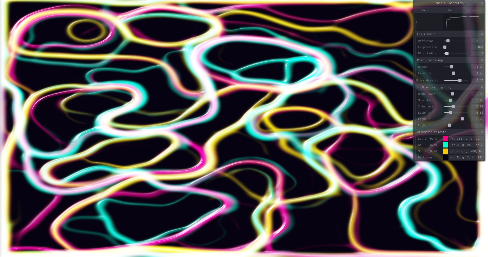

*Leer en otro idioma: [English](README.md), [Español](README.es.md).*

# Simulación de Slime Mold mediante GPGPU



La idea de este proyecto nace de una pregunta: ¿es posible encontrar, de forma eficiente y orgánica, la ruta óptima entre múltiples puntos en sistemas de multiples individuos? Al pensar en ello, el concepto que inmediatamente te viene a la cabeza es la 'mente de enjambre'. Si bien los algoritmos de optimización basados en colonias son un estándar conocido, he querido llevarlos a un "siguiente nivel" visual por medio de distintas técnicas de computación gráfica. De esta premisa surge una simulación multi-agente calculada y renderizada en su totalidad por la GPU.


## Resumen Técnico

La simulación maneja más de 260,000 agentes individuales ejecutándose a 60 FPS estables. Para lograr esto, se omite por completo la CPU para la lógica de simulación y pasa a depender de *Ping-Pong Framebuffer Objects* (FBOs) y shaders GLSL para leer y escribir los datos de estado.

### Precisión de Datos
- **Textura de Estado de Agentes:** `RGBA32F` (Float de 32 bits).
- **Textura de Mapa de Rastros:** `RGBA16F` (Half-Float de 16 bits). Permite la saturación HDR sin limitarse a 1.0, lo que posibilita una difusión fluida y un mapeo tonal (*tone mapping*) cinemático.
- **Mezcla (Blending) Manual:** Debido a la falta de compatibilidad en muchos dispositivos móviles para `gl.BLEND` sobre texturas de coma flotante, se suma matemáticamente dentro del *pipeline* de los shaders para preservar la precisión del Half-Float.

## Fundamentos Matemáticos y Algorítmicos

### 1. Comportamiento del Agente (Sentir-Rotar-Moverse)
Los agentes depositan feromonas y cambian de dirección basándose en las densidades locales del rastro de estas.
- **Muestreo Sensorial:** Cada agente lee el mapa de rastros en tres puntos: justo delante, a la izquierda y a la derecha (definidos por el *Ángulo de Sensor* y la *Distancia de Sensor*).
- **Simbiosis / Matriz de Atracción ($M$):** Una matriz 3x3 define cómo interactúan las especies. El "peso" sensorial $W$ para un agente de la especie $S$ se calcula como el producto de las concentraciones de rastro muestreadas $C$ y la fila de atracción para esa especie:
  $$W = C_0 M_{s,0} + C_1 M_{s,1} + C_2 M_{s,2}$$
- **Dirección:** El agente compara los pesos. Si el peso frontal es el mayor, sigue recto, si no, gira hacia el peso máximo sumando o restando la variable *Agilidad de Giro* multiplicada por un número flotante pseudoaleatorio (generado vía *PCG Hash*).

### 2. Desenfoque y Procesamiento de Rastros
Para simular la difusión de las feromonas, el mapa de rastros se desenfoca en cada fotograma.
- En lugar de usar un kernel 2D de complejidad $O(N^2)$ , la difusión utiliza un **Desenfoque Separable 1D** ($O(2N)$).
- Procesa un desenfoque en el eje $X$ hacia un FBO intermedio, seguido de un desenfoque en el eje $Y$. Esto reduce drásticamente las lecturas de textura, permitiendo radios de desenfoque muy grandes con un impacto en el rendimiento insignificante.
- **Decaimiento:** El valor final del rastro $T_{t}$ se calcula interpolando linealmente entre el mapa original y el desenfocado (Difusión), sumando los depósitos de los nuevos agentes, y restando una constante de Evaporación.

### 3. Iluminación Volumétrica 2.5D
Para renderizar el mapa de densidad plano como un fluido viscoso tridimensional, el shader de pantalla calcula las normales de superficie en tiempo real.
- **Filtro Sobel / Gradiente:** El shader lee los píxeles vecinos para calcular las derivadas parciales de la densidad $D$:
  $$\nabla D_x = D_{derecha} - D_{izquierda}$$
  $$\nabla D_y = D_{arriba} - D_{abajo}$$
- **Normal de Superficie:** El vector normal $N$ se deriva del gradiente: $N = \text{normalize}(-\nabla D_x \cdot \text{scale}, -\nabla D_y \cdot \text{scale}, 1.0)$.
- **Sombreado Blinn-Phong:** Usando $N$, el shader calcula la luz difusa (Lambertiana) y los brillos especulares usando un vector intermedio (*Half-way vector*, $H = \text{normalize}(L + V)$).
- **Tone Mapping:** Se aplica una función exponencial de mapeo tonal ($C_{out} = 1.0 - e^{-C_{in} \cdot E}$) globalmente para preservar el matiz (Hue) bajo la acumulación HDR sin quemar los colores hacia el blanco puro.

---

## Funcionalidades y Controles
Para este proyecto no quería destinar demasiado tiempo en construir la UI para el monitor, así que quise darle una oportunidad a la librería de `tweakpane` y así poder ajustar el valor de todas las variables subyacentes. No es el estilo al que estoy acostumbrado, pero agilizó mucho el testeo durante el desarrollo, así que bastante contento con los resultados.

### Entorno Global
- **Difusión:** Factor de interpolación entre el rastro definido y el rastro desenfocado.
- **Evaporación:** Es un escalar fijo que se resta al mapa de rastros en cada fotograma para simular el decaimiento de feromonas.
- **Radio Desenfoque:** Define el tamaño del kernel $1D$ para el desenfoque separable (de 1 a 10).
- **Gravedad Ratón:** Fuerza de atracción gravitacional del cursor sobre el enjambre.

### Post-Procesado e Iluminación 2.5D
- **Brillo (Bloom):** Multiplicador del efecto de halo alrededor de las áreas de alta densidad.
- **Exposición:** Limita la salida máxima de luminancia en la ecuación del tone mapping HDR.
- **Relieve (Bump Scale):** Multiplicador para el gradiente Sobel, definiendo la "altura" de las normales del fluido.
- **Especular y Cristalinidad:** Controla la intensidad y la dispersión del brillo especular de Blinn-Phong, alterando el material visual desde mate hasta brillante.
- **Luz X/Y/Z:** El vector direccional de la fuente de luz 3D simulada.

### ADN (Por Especie: Rosa, Cian, Oro)
- **Ángulo Sensor:** Desplazamiento rotacional para las sondas sensoriales.
- **Dist. Sensor:** Distancia desde el centro del agente hasta sus puntos de lectura.
- **Agilidad Giro:** Paso angular máximo de giro por fotograma.
- **Velocidad:** Escalar de desplazamiento lineal por fotograma.

### Simbiosis
- **Matriz de Atracción (M00 a M22):** Una matriz donde los valores oscilan entre `-1.0` (Repulsión) y `1.0` (Atracción). Dicta el comportamiento intra e inter-especie (ahora mismo solo tengo dinámicas depredador-presa, comportamiento de rebaño o segregación territorial, pero se podrían añadir facilmente otros patrones).

---

## Despliegue de proyecto

Utilizo **Vite** para el desarrollo local, el empaquetado de módulos y la importación directa de archivos GLSL como cadenas de texto.

```bash
# Instalar dependencias
npm install

# Lanzar el servidor de desarrollo local
npm run dev

# A producción
npm run build
```